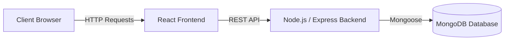

# Sarkar AEP 🚀

> **Build. Automate. Analyze. Ship.**


---

## ✨ Overview

**Sarkar AEP** is a modern, responsive, full-stack web application designed for high-performance portfolio and agency services. It provides a seamless user experience for showcasing achievements, services, and dynamic content, scaling beautifully across desktop and mobile devices.

This project is built to solve the need for a premium, fast, and maintainable web presence that integrates a robust backend for dynamic content management.

## 🎯 Problem Statement

Traditional agency portfolios are often static, hard to maintain, and suffer from poor mobile responsiveness. Sarkar AEP solves this by providing a dynamic full-stack architecture where content is driven by a MongoDB backend and rendered with a lightning-fast Vite + React frontend.

## 💡 Solution

By separating the client and server into a clean MERN architecture and leveraging Firebase for global, scalable hosting, Sarkar AEP delivers a reliable and highly performant platform. The codebase is heavily modularized, prioritizing maintainability and easy future integrations.

## 🚀 Key Features

- ⚡ **Blazing Fast Performance:** Powered by Vite, React, and optimized assets.
- 📱 **Mobile-First Design:** Fully responsive layout with custom breakpoints for seamless scaling.
- 🔐 **Secure Authentication:** JWT-based secure routes and password hashing.
- 📊 **Dynamic Content:** Backend API built on Node.js and Express to serve real-time portfolio data.
- 🚀 **Automated Deployments:** Out-of-the-box support for Firebase Hosting.

## 🧠 How It Works



## 🛠️ Tech Stack

| Category   | Technology                 |
|------------|----------------------------|
| **Frontend** | React, Vite, CSS         |
| **Backend**  | Node.js, Express, JWT      |
| **Database** | MongoDB, Mongoose          |
| **Hosting**  | Firebase Hosting           |

## 📂 Project Structure

```text
sarkar-mern/
│
├── client/              # React frontend (Vite)
│   ├── src/             # UI Components, Pages, Assets
│   └── dist/            # Production build output
│
├── server/              # Node.js backend API
│   ├── models/          # Mongoose schemas
│   ├── controllers/     # Business logic
│   ├── routes/          # API endpoints
│   └── middleware/      # Auth & error handling
│
├── .gitignore           # Ignored files
├── firebase.json        # Firebase hosting configuration
└── README.md            # Project documentation
```

## ⚙️ Installation

To run this project locally, follow these steps:

1. **Clone the repository:**
   ```bash
   git clone <repository-url>
   cd sarkar-mern
   ```

2. **Install Server Dependencies:**
   ```bash
   cd server
   npm install
   ```

3. **Install Client Dependencies:**
   ```bash
   cd ../client
   npm install
   ```

## 🔑 Environment Variables

Sensitive credentials and configurations must be stored in environment variables.

In the `server/` directory, create a `.env` file based on `.env.example`:

```env
PORT=5000
MONGO_URI=mongodb://localhost:27017/your_database_name
JWT_SECRET=your_jwt_secret_here
```

> [!CAUTION]
> **Never commit your `.env` file or real API credentials.**

## ▶️ Running the Project

1. **Start the Backend:**
   ```bash
   cd server
   npm run dev
   ```

2. **Start the Frontend (in a new terminal):**
   ```bash
   cd client
   npm run dev
   ```

## 📸 Screenshots / Demo

*(Coming soon — Placeholders for application screenshots will be added here)*

## 🔒 Security

- Sensitive secrets are stored securely using environment variables.
- The `.env` files are ignored via `.gitignore`.
- Authentication uses secure, salted `bcryptjs` password hashing and stateless JWT tokens.

## 🚀 Deployment

The client application is pre-configured for deployment to **Firebase Hosting**.

To deploy the latest build:
```bash
cd client
npm run deploy
```

## 🤝 Contributing

Contributions are welcome! Please open an issue or submit a Pull Request.

## 📜 License

This project is licensed under the MIT License.
